# 15 ejercicios de práctica
Usa estructuras repetitivas (`for`, `while`, `do-while`), condicionales (`if`, `if-
else`, `switch`), arreglos, operadores aritméticos y lógicos, y manejo básico de
errores cuando sea útil.
---
## 1. Suma y promedio de N números
**Enunciado**
Pide al usuario cuántos números enteros quiere ingresar `n`. Luego pide esos `n`
números, guárdalos en un arreglo y calcula:
- La suma de todos los números.
- El promedio.
**Codigo**
```java
import java.util.Scanner;

public class ejercicio1 {
    public static void main(String[] args) {
        Scanner sc = new Scanner(System.in);
        System.out.println("¿Cuántos números quiere ingresar?: ");
        int op = sc.nextInt();
        int[] numeros = new int[op];
        for (int i = 0; i<numeros.length; i++) {
            System.out.println("Ingresa el número: ");
            numeros[i] = sc.nextInt();
        }
        int suma = 0;
        for (int i = 0; i<numeros.length; i++) {
            suma = suma + numeros[i];
        }
        double prom = (double) suma / numeros.length;
        System.out.println("El resultado de la suma: " + suma + "\nEl promedio es: " + prom);
    }
}
```
**Salida esperada**
---
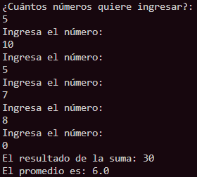
---
## 2. Contar pares, impares, positivos y negativos
**Enunciado**
Pide al usuario un número `n` y luego `n` enteros, guárdalos en un arreglo. Usa
ciclos y condicionales para contar:
- Cuántos son pares.
- Cuántos son impares.
- Cuántos son positivos.
- Cuántos son negativos.
**Codigo**
```java
import java.util.Scanner;

public class ejercicio2 {
    public static void main(String[] args) {
        Scanner sc = new Scanner(System.in);
        System.out.println("¿Cuántos números son?: ");
        int op = sc.nextInt();
        int[] numeros = new int[op];
        int pares = 0;
        int impar = 0;
        int posv = 0;
        int negv = 0;
        int cero = 0;
        for (int i = 0; i<numeros.length; i++) {
            System.out.println("Ingresa el número: ");
            numeros[i] = sc.nextInt();
            if (numeros[i]%2 == 0) {
                pares = pares+1;
            } else {
                impar = impar+1;
            }
            if (numeros[i] > 0) {
                posv = posv+1;
            } else if (numeros[i] < 0) {
                negv = negv+1;
            } else if (numeros[i] == 0) {
                cero = cero+1;
            }
        }
        System.out.println("Pares: " + pares + "\nImpares: " + impar + "\nPositivos: " + posv + "\nNegativos: " + negv + "\nCeros: " + cero);

    }
}
```
**Salida esperada**
---
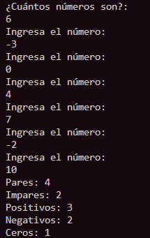
---
## 3. Máximo, mínimo y posiciones
**Enunciado**
Pide `n` enteros, guárdalos en un arreglo. Recorre el arreglo para encontrar:
- El valor máximo y en qué índice(s) aparece.
- El valor mínimo y en qué índice(s) aparece.
**Codigo**
```java
import java.util.Scanner;

public class ejercicio3 {
    public static void main(String[] args) {
        Scanner sc = new Scanner(System.in);
        System.out.println("¿Cuántos números son?: ");
        int op = sc.nextInt();
        int[] numeros = new int[op];
        System.out.println("Ingresa el número: ");
        numeros[0] = sc.nextInt();
        int max = numeros[0];
        int min = numeros[0];
        for (int i = 1; i<numeros.length; i++) {
            System.out.println("Ingresa el número: ");
            numeros[i] = sc.nextInt();
            if (numeros[i] > max ) {
                max = numeros[i];
            } 
            if (numeros[i] < min) {
                min = numeros[i];
            }
        }
        System.out.println("Maximo: " + max + " en indices: ");
        for (int i = 0; i < numeros.length; i++) {
            if (numeros[i] == max) {
                System.out.println(i + " ");
            }
        }
        System.out.println("Minimo: " + min + " en indices: ");
        for (int i = 0; i < numeros.length; i++) {
            if (numeros[i] == min) {
                System.out.println(i + " ");
            }
        }
    }
}
```
**Salida esperada**
---
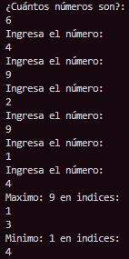
---
## 4. Verificar si el arreglo está ordenado
**Enunciado**
Pide `n` números enteros y guárdalos en un arreglo. Escribe un programa que
**verifique** si el arreglo está ordenado en forma **ascendente** (cada elemento es
mayor o igual al anterior). Usa un ciclo para revisar pares de elementos
consecutivos.
**Codigo**
```java
import java.util.Scanner;

public class ejercicio4 {
    public static void main(String[] args) {
        Scanner sc = new Scanner(System.in);
        System.out.println("¿Cuántos números son?: ");
        int op = sc.nextInt();
        int[] numeros = new int[op];
        int num = 0;
        System.out.println("Ingresa el número: ");
        numeros[0] = sc.nextInt();
        boolean ordenado = true;
        for (int i = 1; i<numeros.length; i++) {
            System.out.println("Ingresa el número: ");
            numeros[i] = sc.nextInt();
            if (numeros[i] < numeros[i-1]) {
                ordenado = false;
                break;
            }
        }
        if (ordenado) {
            System.out.println("El arreglo esta ordenado de forma ascendente");
        } else {
            System.out.println("El arreglo NO esta ordenado de forma ascendente");
        }
    }
}
```
**Salida esperada**
---
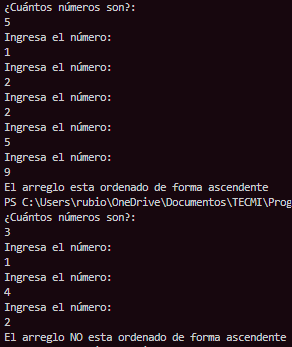
---
## 5. Búsqueda de un elemento (primera y última posición)
**Enunciado**
Pide `n` enteros, guárdalos en un arreglo y luego pide un número `x` a buscar. Usa
un ciclo para:
- Determinar si `x` aparece en el arreglo.
- Si aparece, indicar la **primera** y la **última** posición donde se encontró.
**Codigo**
```java
import java.util.Scanner;

public class ejercicio5 {
    public static void main(String[] args) {
        Scanner sc = new Scanner(System.in);
        System.out.println("¿Cuántos números son?: ");
        int op = sc.nextInt();
        int[] numeros = new int[op];
        for (int i = 0; i<numeros.length; i++) {
            System.out.println("Ingresa el número: ");
            numeros[i] = sc.nextInt();
        }
        System.out.println("Ingresa el número a buscar: ");
        int x = sc.nextInt();
        int primera = -1;
        int ultima = -1;
        for (int i = 0; i < numeros.length; i++) {
            if (numeros[i] == x) {
                if (primera == -1) {
                    primera = i;
                }
                ultima = i;
            }
        }
        if (primera != -1) {
            System.out.println("El número " + x + " se encontro");
            System.out.println("Primera posición: " + primera);
            System.out.println("Ultima posicion: " + ultima);
        } else {
            System.out.println("El número " + x + " no se encontro");
        }
    }
}
```
**Salida esperada**
---
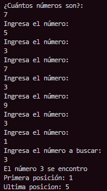
---
## 6. Contar frecuencia de un valor
**Enunciado**
Pide `n` enteros, guárdalos en un arreglo y luego pide un número `x`. Usa un ciclo
para contar cuántas veces aparece `x` en el arreglo.
**Codigo**
```java 
import java.util.Scanner;

public class ejercicio6 {
    public static void main(String[] args) {
        Scanner sc = new Scanner(System.in);
        System.out.println("¿Cuántos números son?: ");
        int op = sc.nextInt();
        int[] numeros = new int[op];
        for (int i = 0; i<numeros.length; i++) {
            System.out.println("Ingresa el número: ");
            numeros[i] = sc.nextInt();
        }
        System.out.println("Ingresa el número a buscar: ");
        int x = sc.nextInt();
        int appeer = 0;
        for (int i = 0; i < numeros.length; i++) {
            if (numeros[i] == x) {
                appeer = appeer+1;
            } 
        }
        if (appeer != 0) {
            System.out.println("El número " + x + " aparece " + appeer + " veces");
        } else {
            System.out.println("El número no se encontro");
        }
    }
}
```
**Salida esperada**
---
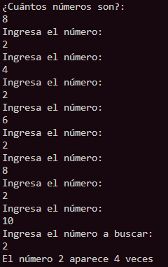
---
## 7. Invertir el arreglo (mostrar al revés)
**Enunciado**
Pide `n` enteros, guárdalos en un arreglo. Sin crear otro arreglo, muestra los
elementos en orden **invertido** usando un ciclo que vaya desde el último índice
hasta el 0.
**Codigo**
```java
import java.util.Scanner;

public class ejercicio7 {
    public static void main(String[] args) {
        Scanner sc = new Scanner(System.in);
        System.out.println("¿Cuántos números son?: ");
        int op = sc.nextInt();
        int[] numeros = new int[op];
        for (int i = 0; i<numeros.length; i++) {
            System.out.println("Ingresa el número: ");
            numeros[i] = sc.nextInt();
        }
        System.out.println("Arreglo invertido: ");
        for (int i = numeros.length-1; i >= 0; i--){
            System.out.println(numeros[i] + " ");
        }
    }
}
```
**Salida esperada**
---
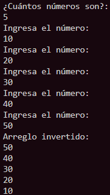
---
## 8. Eliminar (lógicamente) un elemento por valor
**Enunciado**
Pide `n` enteros y guárdalos en un arreglo. Luego pide un número `x` a “eliminar”.
No crees otro arreglo. Recorre el arreglo y cuando encuentres `x`, reemplázalo por
un valor especial (por ejemplo `0` o `-1`) para indicar que está “eliminado
lógicamente”. Al final, muestra el arreglo resultante.
**Codigo**
```java
import java.util.Scanner;

public class ejercicio8 {
    public static void main(String[] args) {
        Scanner sc = new Scanner(System.in);
        System.out.println("¿Cuántos números son?: ");
        int op = sc.nextInt();
        int[] numeros = new int[op];
        for (int i = 0; i<numeros.length; i++) {
            System.out.println("Ingresa el número: ");
            numeros[i] = sc.nextInt();
        }
        System.out.println("Ingresa el número a eliminar: ");
        int x = sc.nextInt();
        for (int i = 0; i<numeros.length; i++) {
            if (numeros[i] == x){
                numeros[i] = 0;
            }
        }
        for (int i = 0; i<numeros.length; i++) {
            System.out.print(numeros[i] + " ");
        }
    }
}
```
**Salida esperada (si usas -1 como marca)**
---
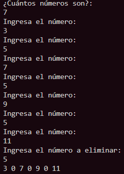
---
## 9. Fusión de dos arreglos ordenados (sin ordenar al final)
**Enunciado**
Tienes dos arreglos **ya ordenados** en forma ascendente, `A` y `B`. Crea un nuevo
arreglo `C` donde mezcles los elementos de `A` y `B` en forma ordenada (como en
“merge” de merge sort). Usa índices separados para `A`, `B` y `C`.
No es necesario que el usuario los ingrese; puedes definirlos en el código para
empezar y luego, si quieres, adaptarlo a entradas por teclado.
**Codigo**
```java
public class ejercicio9 {
    public static void main(String[] args) {
        int[] A = {1, 4, 7};
        int[] B = {2, 3, 6, 8};
        int[] C = new int[A.length + B.length];
        int k = 0;
        for (int i = 0; i < A.length; i++) {
            C[k] = A[i];
            k++;
        }
        for (int i = 0; i < B.length; i++) {
            C[k] = B[i];
            k++;
        }
        for (int i = 0; i < C.length; i++) {
            for (int j = 0; j < C.length-1; j++) {
                if (C[j] > C[j + 1]) {
                    int temp = C[j];
                    C[j] = C[j+1];
                    C[j+1] = temp;
                }
            }
        }
        System.out.println("Arreglos combinados y ordenados: ");
        for (int i = 0; i < C.length; i++) {
            System.out.print(C[i] + " ");
        }
    }
}
```
**Salida esperada**
---
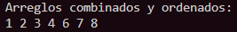
---
## 10. Matriz: suma por filas y por columnas
**Enunciado**
Pide al usuario el número de filas y columnas de una matriz de enteros (por ejemplo
máximo 5x5 para hacerlo manejable), luego pide cada elemento.
- Calcula y muestra la suma de cada fila.
- Calcula y muestra la suma de cada columna.
Usa **arreglos bidimensionales** y ciclos anidados.
**Codigo**
```java
import java.util.Scanner;

public class ejercicio10 {
    public static void main(String[] args) {
        Scanner sc = new Scanner(System.in);
        System.out.println("Ingresa el número de filas: ");
        int fil = sc.nextInt();
        System.out.println("Ingresa el número de columnas: ");
        int col = sc.nextInt();
        int[][] suma = new int[fil][col]; 
        for (int i = 0; i < fil; i++) {
            System.out.println("Fila " + i + ":");
            for (int j = 0; j < col; j++) {
                suma[i][j] = sc.nextInt(); 
            }
        }
        for (int i = 0; i< fil; i++) {
            int sumaFila = 0;
            for (int j = 0; j< col; j++) {
                sumaFila += suma[i][j];
            }
            System.out.println("Suma fila " + i + ":" + sumaFila);
        }
        for (int j = 0; j< col; j++) {
            int sumaColum = 0;
            for (int i = 0; i< fil; i++) {
                sumaColum += suma[i][j];
            }
            System.out.println("Suma columna " + j + ":" + sumaColum);
        }
    }
}
```
**Salida esperada**
---
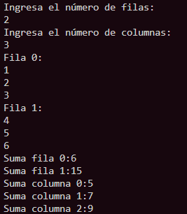
---
## 11. Validar entrada numérica con manejo de errores
**Enunciado**
Escribe un programa que pida al usuario ingresar **exactamente 5 enteros**. Si el
usuario escribe algo que no es entero, captura la excepción
(`InputMismatchException`), muestra un mensaje de error y vuelve a pedir solo ese
valor (no avances al siguiente índice hasta que sea válido). Al final, muestra el
arreglo.
**Codigo**
```java
import java.util.InputMismatchException;
import java.util.Scanner;

public class ejercicio11 {
    public static void main(String[] args) {
        Scanner sc = new Scanner(System.in);
        int[]  number = new int[5];
        int i = 0;
        while (i < number.length) {
            try {
                System.out.print("Ingresa valor " + i + ": ");
                number[i] = sc.nextInt();
                i++;
            } catch (InputMismatchException e) {
                System.out.println("Error: debes ingresar un número entero");
                sc.next();
            }
        }
        System.out.println("Arreglo final: ");
        for (int n : number) {
            System.out.print(n + " ");
        }
    }
}
```
**Salida esperada (interacción típica)**
---
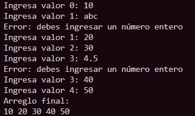
---
## 12. Menú de operaciones sobre un arreglo
**Enunciado**
Crea un programa con un **menú** que permita al usuario:
1. Llenar un arreglo de `n` enteros.
2. Mostrar el arreglo.
3. Mostrar el máximo y el mínimo.
4. Buscar un valor `x` en el arreglo.
5. Salir.
Usa un ciclo `do-while` para repetir el menú hasta que el usuario elija salir, y
`switch` para las opciones. Valida que el usuario haya llenado primero el arreglo
antes de usar las otras opciones.
**Codigo**
```java
import java.util.Scanner;

public class ejercicio12 {
    public static void main(String[] args) {
        Scanner sc = new Scanner(System.in);
        int[] numbers = null;
        boolean salir = false;
        int found = -1;
        do {
            System.out.println("1.Llenar un arreglo de n enteros.");
            System.out.println("2.Mostrar el arreglo.");
            System.out.println("3.Mostrar el máximo y el mínimo.");
            System.out.println("4.Buscar un valor de x en el arreglo.");
            System.out.println("5.Salir.");
            System.out.println("Ingresa tu número de opcion: ");
            int op = sc.nextInt();
            switch (op) {
                case 1:
                    System.out.println("De cuantos números quieres el arreglo: ");
                    int num = sc.nextInt();
                    numbers = new int[num];
                    for (int i = 0; i < numbers.length; i++ ) {
                        System.out.println("Ingresa el número " + i + ": ");
                        numbers[i] = sc.nextInt();
                    }
                    break;
                case 2:
                    if (numbers == null || numbers.length == 0) {
                        System.out.println("Arreglo vacio");
                    } else {
                        for (int i = 0; i < numbers.length; i++) {
                            System.out.print(numbers[i] + " ");
                        }
                    }
                    break;
                case 3:
                    if (numbers == null || numbers.length == 0) {
                        System.out.println("Arreglo vacio");
                    } else {
                        int max = numbers[0];
                        int min = numbers[0];
                        for (int i = 0; i<numbers.length; i++) {
                            if (numbers[i] > max) max = numbers[i];
                            if (numbers[i] < min) min = numbers[i];
                        }
                        System.out.println("Maximo: " + max);
                        System.out.println("Minimo: " + min);
                    }
                    break;
                case 4:
                    if (numbers == null || numbers.length == 0) {
                        System.out.println("Arreglo vacio");
                    } else {
                        System.out.println("¿Que numero quieres buscar?: ");
                        int bucs = sc.nextInt();
                        for (int j = 0; j<numbers.length; j++) {
                            if (numbers[j] == bucs) {
                                found = j;
                            } 
                        }
                        if (found != -1) {
                            System.out.println("El numero se encuentra en la posicion: " + found);
                        } else {
                            System.out.println("El numero no se encuntra en el arreglo");
                        }
                    }
                    break;
                case 5:
                    System.out.println("Saliendo...");
                    salir = true;
            }
        } while (!salir);
    }
}
```
**Salida esperada**
---
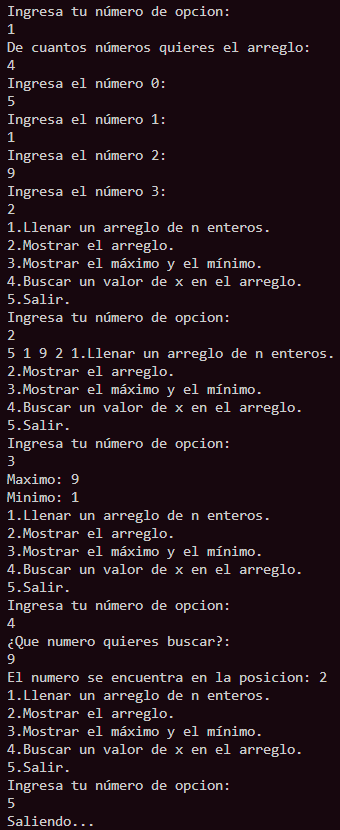
---
## 13. Verificar si dos arreglos son iguales
**Enunciado**
Pide `n` y luego dos arreglos `A` y `B` de tamaño `n`. Usa un ciclo para verificar
si ambos arreglos son **idénticos**:
- Tienen el mismo tamaño.
- Todos los elementos en la misma posición son iguales.
**Codigo**
```java 
import java.util.Scanner;

public class ejercicio13 {
    public static void main(String[] args) {
        Scanner sc = new Scanner(System.in);
        int iqual = 0;
        System.out.print("Ingresa el tamaño de los arreglos: ");
        int num = sc.nextInt();
        int[] arrA = new int[num];
        int[] arrB = new int[num];
        for (int i = 0; i < arrA.length; i++) {
            System.out.println("Ingresa el número para el arreglo A: ");
            arrA[i] = sc.nextInt();
        }
        for (int i = 0; i < arrB.length; i++) {
            System.out.println("Ingresa el numero para el arreglo B: ");
            arrB[i] = sc.nextInt();
        }
        for (int i = 0; i < arrB.length; i++) {
            if (arrA[i] == arrB[i]) {
                iqual = iqual +1;
            }
        }
        if (iqual == arrA.length) {
            System.out.println("Los arreglos son iguales");
        } else {
            System.out.println("Los arreglos no son iguales");
        }
    }
}
```
**Salida esperada**
---
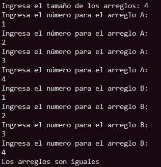
---
## 14. Contar vocales y consonantes en una palabra
**Enunciado**
Pide una palabra (String) al usuario. Convierte la palabra a un arreglo de
caracteres usando `toCharArray()` y recórrelo con un ciclo. Cuenta:
- Cuántas vocales (a, e, i, o, u, mayúsculas o minúsculas).
- Cuántas consonantes (solo letras).
Ignora espacios y caracteres que no sean letras.
**Codigo**
```java
import java.util.Scanner;

public class ejercicio14 {
    public static void main(String[] args) {
        Scanner sc = new Scanner(System.in);
        int vocales = 0;
        int consonantes = 0;
        System.out.println("Ingresa la palabra: ");
        String palabra = sc.nextLine();
        char[] letras = palabra.toCharArray();
        for (int i = 0; i < letras.length; i ++) {
            char c = Character.toLowerCase(letras[i]);
            if (c == 'a' || c == 'e' || c == 'i' || c == 'o' || c == 'u' ) {
                vocales++;
            } else {
                consonantes++;
            }
        }
        System.out.println("Vocales: " + vocales);
        System.out.println("Consonantes: " + consonantes);
    }
}
```
**Salida esperada**
---
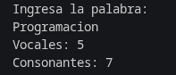
---
## 15. Sistema simple de calificaciones con promedio, mayor y menor
**Enunciado**
Un grupo tiene `n` estudiantes. Pide `n` y luego un arreglo de `n` calificaciones
(double). Usa ciclos y condicionales para:
- Calcular el promedio.
- Encontrar la calificación más alta y la más baja.
- Contar cuántos están aprobados (>= 70) y cuántos reprobados.
**COdigo**
```
import java.util.Scanner;

public class ejercicio15 {
    public static void main(String[] args) {
        Scanner sc = new Scanner(System.in);
        double suma =0;
        int repro = 0;
        int aprob = 0;
        System.out.println("¿Cuantos estudiantes son?: ");
        int estu = sc.nextInt();
        double[] calf = new double[estu];
        System.out.println("Ingresa la califcación del estudiantes 0: ");
            calf[0] = sc.nextDouble();
            suma = suma + calf[0];
            if (calf[0] >= 70) {
                aprob = aprob + 1;
            } else {
                repro = repro + 1;
            }
            double min = calf[0];
            double max = calf[0];
        for (int i = 1; i<calf.length; i++) {
            System.out.println("Ingresa la califcación del estudiantes " + i + ": ");
            calf[i] = sc.nextDouble();
            suma = suma + calf[i];
            if (calf[i] >= 70) {
                aprob = aprob + 1;
            } else {
                repro = repro + 1;
            }
            if (calf[i] < min ) {
                min = calf[i];
            }
            if (calf[i] > max) {
                max = calf[i];
            }
        }
        double prom = suma/calf.length;
        System.out.println("Promedio: " + prom);
        System.out.println("Máxima: " + max);
        System.out.println("Mínima: " + min);
        System.out.println("Aprobados: " + aprob);
        System.out.println("Reprobados: " + repro);
    }
}
``` 
**Salida esperada**
---
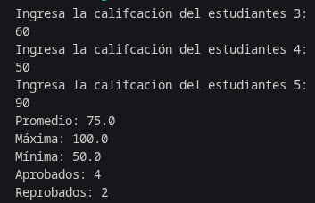
---

