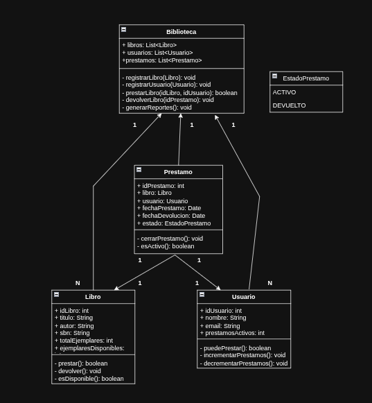

# Avance del Proyecto

## Instrucciones

Para desarrollar un **Sistema de Gestión de Biblioteca**, es necesario considerar los siguientes aspectos.

---

## Requisitos del Sistema

### Requisitos funcionales

* Debe permitir registrar y consultar libros, usuarios y préstamos.
* Debe validar que los datos ingresados sean correctos y coherentes.
* Debe controlar que no se presten más libros de los disponibles ni que se exceda el límite de **dos ejemplares por usuario**.
* Debe generar reportes en pantalla sobre el estado de la biblioteca, incluyendo el número de libros, usuarios y préstamos.

---

### Requisitos no funcionales

* Debe ser fácil de usar.
* Debe ser robusto y manejar adecuadamente los errores.
* Debe ser eficiente.
* Debe ser escalable y permitir agregar nuevas funcionalidades en el futuro.

---

## Diseño y Modelado del Sistema

Para realizar el diseño y modelado del sistema, se debe seguir el siguiente proceso:

* Identificar las clases y los objetos que intervienen en el sistema, así como sus atributos y métodos.
* Definir las relaciones entre las clases y los objetos (asociación, agregación, composición y herencia).
* Elaborar los diagramas UML correspondientes: diagrama de clases, casos de uso, secuencia, estado, etc.
* Documentar el diseño explicando el significado y función de cada elemento.

---

# Clases y Objetos

## Clase `Libro`

### Atributos

* `idLibro: int`
* `titulo: String`
* `autor: String`
* `isbn: String`
* `totalEjemplares: int`
* `ejemplaresDisponibles: int`

### Métodos

* `prestar(): boolean`
* `devolver(): void`
* `esDisponible(): boolean`

---

## Clase `Usuario`

### Atributos

* `idUsuario: int`
* `nombre: String`
* `email: String`
* `prestamosActivos: int`

### Métodos

* `puedePrestar(): boolean`
* `incrementarPrestamos(): void`
* `decrementarPrestamos(): void`

---

## Clase `Prestamo`

### Atributos

* `idPrestamo: int`
* `libro: Libro`
* `usuario: Usuario`
* `fechaPrestamo: Date`
* `fechaDevolucion: Date`
* `estado: EstadoPrestamo`

### Métodos

* `cerrarPrestamo(): void`
* `esActivo(): boolean`

---

## Clase `Biblioteca`

### Atributos

* `libros: List<Libro>`
* `usuarios: List<Usuario>`
* `prestamos: List<Prestamo>`

### Métodos

* `registrarLibro(Libro libro): void`
* `registrarUsuario(Usuario usuario): void`
* `prestarLibro(int idLibro, int idUsuario): boolean`
* `devolverLibro(int idPrestamo): void`
* `generarReportes(): void`

---

## Enum `EstadoPrestamo`

* `ACTIVO`
* `DEVUELTO`

---

# Relaciones entre Clases

* `Biblioteca (1) —— (N) Libro`
* `Biblioteca (1) —— (N) Usuario`
* `Biblioteca (1) —— (N) Prestamo`
* `Prestamo (1) —— (1) Libro`
* `Prestamo (1) —— (1) Usuario`

---

# Diagrama UML



---

# Código del Menú

```java
Scanner sc = new Scanner(System.in);
Biblioteca biblioteca = new Biblioteca();

int opcion;

do {
    System.out.println("\n===== SISTEMA DE GESTIÓN DE BIBLIOTECA =====");
    System.out.println("1. Registrar libro");
    System.out.println("2. Registrar usuario");
    System.out.println("3. Consultar libros");
    System.out.println("4. Prestar libro");
    System.out.println("5. Devolver libro");
    System.out.println("6. Generar reportes");
    System.out.println("0. Salir");
    System.out.print("Seleccione una opción: ");

    opcion = sc.nextInt();
    sc.nextLine(); 

    switch (opcion) {
        case 1:
            registrarLibro(sc, biblioteca);
            break;
        case 2:
            registrarUsuario(sc, biblioteca);
            break;
        case 3:
            biblioteca.generarReportes();
            break;
        case 4:
            prestarLibro(sc, biblioteca);
            break;
        case 5:
            devolverLibro(sc, biblioteca);
            break;
        case 6:
            biblioteca.generarReportes();
            break;
        case 0:
            System.out.println("Saliendo del sistema...");
            break;
        default:
            System.out.println("Opción inválida. Intente de nuevo.");
    }

} while (opcion != 0);

sc.close();
```

---

## Explicación del Menú

El menú funciona mediante un ciclo `do-while`, lo que permite que el sistema se repita hasta que el usuario seleccione la opción `0` para salir.

Dentro del ciclo:

* Se muestran las opciones disponibles.
* Se captura la opción ingresada por el usuario.
* Se utiliza una estructura `switch` para ejecutar la acción correspondiente.
* Se incluye un caso `default` para manejar opciones inválidas.

---

# Proyecto Final

## Instrucciones

El objetivo de esta segunda fase es implementar y probar el sistema diseñado anteriormente, utilizando un lenguaje de Programación Orientada a Objetos (POO). Para ello, se deben aplicar conceptos como:

* Abstracción
* Encapsulamiento
* Polimorfismo
* Conversión de objetos

---

## Pasos para la Implementación

* Crear las clases y objetos que representen el sistema, asignando los atributos y métodos correspondientes.
* Implementar las relaciones entre clases utilizando herencia, polimorfismo y otros mecanismos del lenguaje.
* Desarrollar las funcionalidades empleando estructuras de datos y control de flujo (arreglos, listas, condicionales, ciclos, etc.).
* Realizar pruebas del sistema proporcionando datos de entrada y verificando el correcto funcionamiento.
* Documentar la implementación, explicando el código fuente y los resultados obtenidos.
* Elaborar una conclusión personal sobre el proceso de desarrollo y el aprendizaje adquirido.

---

# Codigo Final

```java
import java.util.Scanner;
import java.util.Date;
import java.util.ArrayList;

enum LoanStatus {
  ACTIVE,
  RETORNED
}

class Book {
  private static int counter = 1;
  private int idBook;
  private String title;
  private String author;
  private String isbn;
  private int totalCopy;
  private int availableCopys;

  public Book(String title, String author, String isbn, int totalCopy) {
    this.idBook = counter++;
    this.title = title;
    this.author = author;
    this.isbn = isbn;
    this.totalCopy = totalCopy;
    this.availableCopys = totalCopy;
  }

  public boolean lend() {
    if (availableCopys > 0) {
      availableCopys--;
      return true;
    }
    return false;
  }

  public void retrn() {
    if (availableCopys < totalCopy) {
      availableCopys++;
    }
  }

  public boolean available() {
    return availableCopys > 0;
  }

  public int getIdBook() {
    return idBook;
  }

  public String info() {
    return "ID: " + idBook + " | Titulo: " + title + " | Autor: " + author + " | ISBN: " + isbn + " | Total: "
        + totalCopy + " | Disponibles: " + availableCopys;
  }
}

class User {
  private static int counter = 1;
  private int idUser;
  private String name;
  private String gmail;
  private int activeLoans;

  public User(String name, String gmail) {
    this.idUser = counter++;
    this.name = name;
    this.gmail = gmail;
    this.activeLoans = 0;
  }

  public boolean canLoan() {
    return activeLoans < 2;
  }

  public void incrementLoans() {
    activeLoans++;
  }

  public void decreaseLoans() {
    if (activeLoans > 0) {
      activeLoans--;
    }
  }

  public int getIdUser() {
    return idUser;
  }

  public String info() {
    return "ID: " + idUser + " | Nombre: " + name + " | Gmail: " + gmail + " | Prestamos activos: " + activeLoans;
  }
}

class Loan {
  private static int counter = 1;
  private int idLoan;
  private Book book;
  private User user;
  private Date loanDate;
  private Date loanRetorned;
  private LoanStatus status;

  public Loan(Book book, User user) {
    this.idLoan = counter++;
    this.book = book;
    this.user = user;
    this.loanDate = new Date();
    this.status = LoanStatus.ACTIVE;
  }

  public void closeLoan() {
    if (status == LoanStatus.ACTIVE) {
      status = LoanStatus.RETORNED;
      loanRetorned = new Date();
      book.retrn();
      user.decreaseLoans();
    }
  }

  public boolean onActive() {
    return status == LoanStatus.ACTIVE;
  }

  public int getIdLoan() {
    return idLoan;
  }

  public Book getbook() {
    return book;
  }

  public User getUser() {
    return user;
  }

  public String info() {
    return "ID: " + idLoan + " | Libro: " + book.getIdBook() + " | Usuario: " + user.getIdUser()
        + " | Fecha del prestamo: " + loanDate + " | Fecha de devolucion: " + loanRetorned + " | Estado: " + status;
  }
}

class Library {
  private ArrayList<Book> books = new ArrayList<>();
  private ArrayList<User> users = new ArrayList<>();
  private ArrayList<Loan> loans = new ArrayList<>();

  public void registerBook(Book book) {
    books.add(book);
  }

  public void registerUser(User user) {
    users.add(user);
  }

  public boolean loanBook(int idBook, int idUser) {
    Book book = findBook(idBook);
    User user = findUser(idUser);

    if (book == null || user == null) {
      System.out.println("Libro o usuario no encontrado");
      return false;
    }

    if (!book.available()) {
      System.out.println("No hay copias disponibles");
      return false;
    }

    if (!user.canLoan()) {
      System.out.println("El usuario ya tiene el maximo de prestamos permitidos");
      return false;
    }

    book.lend();
    user.incrementLoans();

    Loan newt = new Loan(book, user);
    loans.add(newt);

    System.out.println("Prestamo realizado correctamente");
    return true;
  }

  public void returnBook(int idLoan) {
    for (Loan l : loans) {
      if (l.getIdLoan() == idLoan && l.onActive()) {
        l.closeLoan();
        System.out.println("Libro devuelto correctamente");
        return;
      }
    }
    System.out.println("Prestamo no encontrado");
  }

  public void generateReport() {
    System.out.println("--- Libros ---");
    if (books.isEmpty()) {
      System.out.println("No hay libros registrados");
    } else {
      for (Book b : books)
        System.out.println(b.info());
    }

    System.out.println("--- Usuarios ---");
    if (users.isEmpty()) {
      System.out.println("No hay usuarios registrados");
    } else {
      for (User u : users)
        System.out.println(u.info());
    }

    System.out.println("--- Prestamos ---");
    if (loans.isEmpty()) {
      System.out.println("No hay prestamos registrados");
    } else {
      for (Loan l : loans)
        System.out.println(l.info());
    }
  }

  private Book findBook(int id) {
    for (Book b : books)
      if (b.getIdBook() == id)
        return b;
    return null;
  }

  private User findUser(int id) {
    for (User u : users)
      if (u.getIdUser() == id)
        return u;
    return null;
  }
}

public class finalproyect {
  public static void main(String[] args) {
    Scanner sc = new Scanner(System.in);
    Library library = new Library();
    int op;
    do {
      System.out.println("\n----- SISTEMA DE GESTIÓN DE BIBLIOTECA -----");
      System.out.println("1. Registrar libro");
      System.out.println("2. Registrar usuario");
      System.out.println("3. Reporte de libros y usaurios");
      System.out.println("4. Prestar libro");
      System.out.println("5. Devolver libro");
      System.out.println("0. Salir");
      System.out.print("Seleccione una opción: ");
      try {
        op = sc.nextInt();
      } catch (Exception e) {
        System.out.println("Debes ingresar un numero");
        sc.nextLine();
        op = -1;
        continue;
      }
      sc.nextLine();
      switch (op) {
        case 1:
          try {
            System.out.println("--- Registrar libro ---");
            System.out.print("Titulo: ");
            String title = sc.nextLine();
            System.out.print("Autor: ");
            String author = sc.nextLine();
            System.out.print("ISBN: ");
            String isbn = sc.nextLine();
            System.out.print("Total de copias: ");
            int total = sc.nextInt();
            if (total <= 0) {
              System.out.println("El total debe ser mayor a 0");
              break;
            }
            Book book = new Book(title, author, isbn, total);
            library.registerBook(book);
            System.out.println("Libro registrado correctamente");
          } catch (Exception e) {
            System.out.println("Error en lo ingresado");
            sc.nextLine();
          }
          break;
        case 2:
          try {
            System.out.println("--- Registrar usuario ---");
            System.out.print("Nombre: ");
            String name = sc.nextLine();
            System.out.print("Gmail: ");
            String gmail = sc.nextLine();
            User user = new User(name, gmail);
            library.registerUser(user);
            System.out.println("Usuario registrado correctamente");
          } catch (Exception e) {
            System.out.println("Error en lo ingresado");
            sc.nextLine();
          }
          break;
        case 3:
          System.out.println("--- Reporte de libros y usuarios ---");
          library.generateReport();
          break;
        case 4:
          System.out.println("--- Prestar libro ---");
          System.out.print("ID del libro: ");
          int bookLoan = sc.nextInt();
          System.out.print("ID del usuario: ");
          int userLoan = sc.nextInt();
          library.loanBook(bookLoan, userLoan);
          break;
        case 5:
          System.out.println("--- Buscar un prestamo ---");
          System.out.print("ID del prestamo: ");
          int idLoan = sc.nextInt();
          library.returnBook(idLoan);
          break;
        case 0:
          System.out.println("Saliendo...");
          break;
        default:
          System.out.println("Opción inválida");
      }

    } while (op != 0);
  }
}
```

---

**Ejemplo de salida**


.png)

.png)
